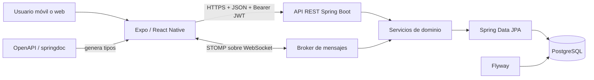

# SubastApp

Aplicación móvil académica para gestionar subastas dinámicas ascendentes y permitir que sus usuarios participen de manera remota. El proyecto fue desarrollado como Trabajo Práctico Obligatorio de **Desarrollo de Aplicaciones I (UADE), primer cuatrimestre de 2026**.

> Este repositorio es un proyecto educativo. No representa una plataforma comercial ni procesa pagos reales.

## Sobre el proyecto

SubastApp digitaliza el circuito de una casa de subastas: registro y admisión de clientes, publicación de catálogos, participación y pujas en tiempo real, adjudicación de bienes y seguimiento posterior. También contempla el circuito inverso, en el que un cliente propone artículos propios para una futura subasta.

La solución implementa, entre otros, los siguientes casos de uso:

- registro en dos etapas, autenticación, recuperación de cuenta y perfiles con categorías;
- alta y verificación de medios de pago (cuenta bancaria, tarjeta y cheque certificado);
- consulta pública de subastas y catálogos, reservando información sensible para usuarios autenticados;
- inscripción de asistentes y validación de la categoría necesaria para participar;
- pujas con límites de negocio y actualización en tiempo real;
- administración de subastas, catálogos, productos, usuarios, empleados y subastadores;
- postulación, inspección, aceptación o rechazo de bienes y consulta de sus seguros;
- notificaciones privadas, historial, métricas de actividad, multas, pagos y entregas.

El enunciado funcional completo, incluyendo reglas de negocio y entregables académicos, se conserva en [`TPO-DAI.md`](TPO-DAI.md).

## Arquitectura

El repositorio es un **monorepo** formado por dos aplicaciones independientes:

```text
SubastApp
├── client/                         # Aplicación Expo / React Native
│   ├── app/                        # Pantallas y rutas basadas en archivos
│   ├── components/                 # Componentes reutilizables y primitivas de UI
│   ├── context/                    # Sesión y conexión WebSocket
│   ├── lib/                        # Cliente HTTP, stores y utilidades
│   └── types/api.d.ts              # Contrato generado desde OpenAPI
├── server/                         # API Spring Boot
│   └── src/main/
│       ├── java/.../subastapp/
│       │   ├── controller/         # API REST y DTOs por dominio
│       │   ├── service/            # Casos de uso y reglas de negocio
│       │   ├── repository/         # Acceso a datos con Spring Data JPA
│       │   ├── entity/             # Modelo persistente y enumeraciones
│       │   ├── config/             # Seguridad, JWT, OpenAPI y WebSocket
│       │   └── exception/          # Manejo centralizado de errores
│       └── resources/db/migration/ # Evolución y datos iniciales con Flyway
├── utils/                          # Utilidades auxiliares de desarrollo
└── TPO-DAI.md                      # Enunciado académico
```

### Flujo de comunicación



El backend sigue una arquitectura por capas. Los controladores reciben y documentan las solicitudes, los servicios concentran las reglas del dominio y los repositorios aíslan la persistencia. La autenticación REST es *stateless* mediante JWT; el mismo token se valida al abrir la conexión STOMP. Los eventos generales de una subasta se publican en destinos `/topic`, mientras que las notificaciones particulares se entregan mediante `/user/queue`.

En el cliente, **Expo Router** organiza la navegación en los grupos `auth`, `admin` y `(tabs)`. Los contextos globales mantienen la sesión y el WebSocket, mientras que **Zustand** conserva el estado transversal de subastas y notificaciones. El token se persiste con SecureStore y todas las llamadas HTTP utilizan un único cliente tipado.

### Contrato entre frontend y backend

El servidor es la fuente de verdad del contrato. **springdoc-openapi** expone el esquema en `/api-docs`; `openapi-typescript` genera `client/types/api.d.ts` y `openapi-fetch` consume esos tipos. Por eso, ante un cambio en un endpoint se debe actualizar su documentación y regenerar el cliente, en lugar de editar el archivo de tipos manualmente.

## Tecnologías

### Aplicación cliente

- **Expo SDK 54**, **React Native 0.81** y **React 19**;
- **TypeScript 5.9** en modo estricto y Expo Router 6;
- **NativeWind / Tailwind CSS** para estilos;
- **Zustand** para estado global;
- **openapi-fetch** y tipos generados con **openapi-typescript**;
- **STOMP.js** para comunicación en tiempo real;
- APIs nativas de Expo para cámara, imágenes, documentos, ubicación, notificaciones, biometría y almacenamiento seguro.

### Servidor y datos

- **Java 25**, **Spring Boot 4** y Maven Wrapper;
- Spring MVC, Validation, Security, Data JPA y Actuator;
- **PostgreSQL** como base de datos principal y H2 disponible en tiempo de ejecución;
- **Flyway** para migraciones versionadas;
- **JWT (JJWT)** para autenticación y autorización por roles;
- **WebSocket + STOMP** para pujas y notificaciones;
- **springdoc-openapi / Swagger UI** para documentación interactiva;
- Lombok y contenedor Docker multi-stage.

## Dominios funcionales de la API

La API agrupa sus recursos bajo `/api/v1` (con la excepción histórica de `/productos`) y cubre:

| Dominio | Responsabilidad |
| --- | --- |
| Autenticación | pre-registro, activación, ingreso, comprobación y recuperación |
| Personas y clientes | perfil, admisión, categorías, habilitación, multas y medios de pago |
| Subastas | agenda, catálogo, ítems, asistentes, pujas, ganadores y registro de ventas |
| Productos y seguros | carga con imágenes, inspección, habilitación y pólizas |
| Dueños | bienes ofrecidos e historial de ventas |
| Administración | empleados, sectores, subastadores y países |
| Notificaciones | bandeja personal, lectura y entrega en tiempo real |
| Estadísticas | participaciones, historial, pujas y agregados globales |

La documentación exacta de parámetros, respuestas y códigos HTTP se encuentra en Swagger cuando el servidor está en ejecución.

## Requisitos

- **Java 25**;
- una instancia de **PostgreSQL**;
- **Node.js** y npm compatibles con Expo SDK 54;
- un emulador Android/iOS, Expo Go o navegador para ejecutar el cliente.

No hace falta instalar Maven globalmente: el repositorio incluye Maven Wrapper.

## Puesta en marcha local

### 1. Base de datos y backend

Crear una base PostgreSQL (por ejemplo, `subastas`) y configurar las variables del servidor:

```bash
export DB_URL=jdbc:postgresql://localhost:5432/subastas
export DB_USERNAME=postgres
export DB_PASSWORD=postgres
export DB_JWT_KEY='una-clave-segura-de-al-menos-64-caracteres-para-desarrollo-local'
```

Son opcionales `PORT` (por defecto `4002`), `ADMIN_EMAILS`, `EMPLEADO_SISTEMA_ID`, `RESEND_API_KEY`, `RESEND_FROM` y `DISCORD_WEBHOOK_URL`. Flyway crea y valida el esquema al iniciar la aplicación.

```bash
cd server
./mvnw spring-boot:run
```

Con el servicio iniciado quedan disponibles:

- API: `http://localhost:4002`;
- Swagger UI: `http://localhost:4002/docs`;
- OpenAPI JSON: `http://localhost:4002/api-docs`;
- health check: `http://localhost:4002/actuator/health`;
- WebSocket nativo: `ws://localhost:4002/api/v1/ws/native`.

### 2. Aplicación cliente

```bash
cd client
npm install
cp .env.example .env
```

Ajustar la URL del backend en `.env` (el puerto local predeterminado del servidor es `4002`):

```dotenv
EXPO_PUBLIC_API_URL=http://localhost:4002
```

En un dispositivo físico, `localhost` apunta al propio teléfono; se debe utilizar la IP de la computadora o una URL de túnel accesible desde el dispositivo.

```bash
npm run start
# Alternativas:
npm run android
npm run ios
npm run web
```

### 3. Regenerar el contrato tipado

Con el backend ejecutándose en el puerto `4002`:

```bash
cd client
npm run api:generate
```

## Comandos útiles

| Proyecto | Comando | Descripción |
| --- | --- | --- |
| Cliente | `npm run start` | inicia Expo |
| Cliente | `npm run lint` | ejecuta ESLint mediante Expo |
| Cliente | `npm run api:generate` | regenera los tipos desde OpenAPI |
| Servidor | `./mvnw test` | ejecuta la suite de pruebas |
| Servidor | `./mvnw clean package` | compila y empaqueta el servicio |
| Servidor | `./mvnw spring-boot:run` | inicia la API local |

## Reglas de negocio destacadas

- Solo puede pujar un cliente admitido cuya categoría alcance la de la subasta y que posea un medio de pago verificado.
- Un usuario puede estar conectado a una única subasta por vez.
- Cada puja debe superar a la mejor oferta. En las categorías regulares, el incremento válido está entre el **1 % y el 20 % del precio base**; oro y platino no tienen el límite superior.
- No se habilita una nueva puja hasta confirmar la anterior, evitando inconsistencias concurrentes.
- Al cerrar un ítem se registra al ganador, el medio de pago, el envío y el seguimiento del cobro.
- Un impago genera una multa del **10 %** de la oferta e inhabilita al usuario hasta regularizar su situación.

## Seguridad y persistencia

- Las contraseñas se almacenan mediante el encoder configurado por Spring Security.
- Los endpoints protegidos reciben `Authorization: Bearer <token>` y la autorización combina roles con comprobaciones de propiedad del recurso.
- El cliente guarda la sesión en `expo-secure-store`.
- Las conexiones STOMP requieren el JWT en el frame `CONNECT`.
- JPA valida el modelo, pero no crea el esquema: toda modificación estructural debe incorporarse como una nueva migración Flyway.
- Los secretos y credenciales deben mantenerse en variables de entorno y nunca versionarse.

## Estado y alcance académico

El repositorio reúne una implementación en evolución del caso propuesto, además de pantallas administrativas que facilitan la demostración y evaluación. Algunos endpoints conservan operaciones pendientes de completar. Incluye una prueba de contexto de Spring Boot, pero el cliente aún no tiene un *test runner* automatizado configurado. El streaming audiovisual mencionado en el enunciado queda expresamente fuera del alcance; el tiempo real implementado corresponde a pujas y notificaciones.

## Licencia

Distribuido bajo los términos de la licencia incluida en [`LICENSE`](LICENSE).
